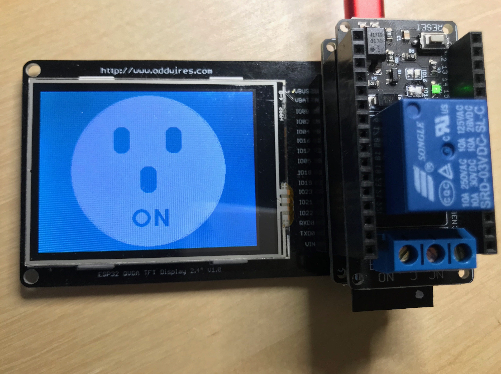

# IoT-Bus Mozilla IoT Examples

These examples are designed to run on IoT-Bus boards by oddWires. In each case, they demonstrate how to create a mozilla-iot "thing" and expose it through the mozilla-iot gateway running on a raspberry pi on the same Wi-Fi network. We will refer to a mozilla-iot thing as a Thing in this document. To setup a gateway see here : 

https://hacks.mozilla.org/2018/02/how-to-build-your-own-private-smart-home-with-a-raspberry-pi-and-mozillas-things-gateway/

In each case you will have to enter your ssid and password within the main cpp file otherwise you will not reach the gateway. 

    //TODO: Hard-code your WiFi credentials here (and keep it private)
    const char* ssid = "........";
    const char* password = "........";

These examples are structured for Platformio but can be run using the Arduino IDE by renaming the source file as .ino and saving it in a folder of the same name. If you run under Arduino you'll have to ensure each library is installed in the "Arduino/Libraries" folder. You can find the library dependencies for each in the platformio.ini file.

## iot-bus-led-thing

This example create a Thing that enables the built-in LED on GPIO5 to be set through the mozilla-iot domain.

## iot-bus-ledlamp_thing

This example create a Thing that enables the status and brightness of the built-in LED on GPIO5 to be set through the mozilla-iot domain.

## iot-bus-dht11_thing

This example creates a Thing that exposes temperature and humidity properties and also displays the temperature locally.

Connect a DHT11 Temperature Sensor and run:
    
    DATA -> GPIO4
    VCC  -> USB (Typically VIN is OK if using battery(3.7-42V) but not 3V3 as not high enough)
    GND  -> GND

## iot-bus-hcsr04-thing

This example creates a Thing that exposes the current distance reading or the HC-SR04 ultrasonic distance sensor and also displays the distance locally.

Connect an HC-SR04 Ultrasonic Distance Sensor and run:

    TRIG -> GPIO2
    ECHO -> GPIO4
    VCC  -> USB (5V) The ultrasonic sender needs higher than 3.3V and the analog receiver is tuned for half of 5V
    GND  -> GND 

## iot-bus-hcsr501-pir-thing

This example creates a Motion Sensor Thing that triggers on movement. It sets the on-board LED on triggering and updates the mozilla-iot interface appropriately.

Connect an HC-SR501 Passive Infrared Sensor or any similar device and run:
    
    OUT  -> GPIO4 
    VCC  -> USB (Typically VIN is OK if using battery(3.7-42V) but not 3V3 is not high enough)    
    GND  -> GND 

## iot-bus-touch-thing

This example creates a Touch Switch Thing that triggers when one of the capacitive touch pins on the ESP32 are touched. It sets the on-board LED on triggering and updates the mozilla-iot interface appropriately.

Connect a wire to GPIO4 and run.   

## iot-bus-calculator-thing    

This example is a simple integer calculator that creates a Thing that exposes the two numbers, the last function and the result. It requires the IoT-Bus display.

## iot-bus-window-door-sensor-thing

This example shows how to use a typical magnetic door sensor. Just connect one side of the contacts to GPIO4 and the other to GND. When the contacts are open the door sensor will show open in the mozilla interface and when they are shut the door will show shut.

## iot-bus-relay-thing and iot-bus-relay-thing-display-touch

These examples uses an IoT-Bus relay board together with an IoT-Bus Io processor to expose the relay status and to enable the user to change through your mozilla-iot domain. In the second example the current status of the relay is also shown on the display. The touchscreen is enabled so it can be switched on and off locally. The status will be reflected by mozilla-iot.